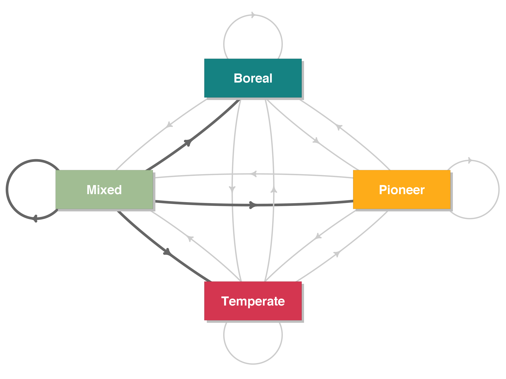

```{r setup, echo = F}
knitr::opts_chunk$set(
  comment = "#",
  collapse = TRUE,
  warning = FALSE,
  message = FALSE,
  echo = FALSE,
  fig.width=5, fig.height=5,
  fig.align = 'center'
)
```

```{r, echo = F}
options(repos=structure(c(CRAN="http://cran.r-project.org")))
```

## Déplacement des niches

.center[

]

---
## Déplacement des niches

.center[

]

---
## Déplacement des niches

.center[

]

---
## Déplacement des niches

Future enveloppe climatique de l'Érable à sucre (2071-2100)

.center[

]

.footnote[McKenney et al. 2007. BioScience.]

---
## Contraintes à la migration


---
## États alternatifs stables

<br>

.pull-left[
]

.pull-right[
]

<br>

.center[]

.footnote[Johnstone et al. 2016]

---
### Réponses des écosystèmes aux changements

.center[]

.footnote[Scheffer & Carpenter 2003]

---
## bjectifs


**Décrire la dynamique de transition des communautés forestières du Québec au cours des dernières décennies et identifier les éléments déclencheurs.**


> Est-ce qu’il y a eu des transitions d’état dans les forêts au cours des dernières décennies?
> 
>  Quels facteurs environnementaux déclenchent ces transitions de communautés? 
> 
>  Est-ce que les perturbations peuvent accélérer certaines transitions? 


.center[.image-holder[
 
 
 
 

]]


---
## Hypothèses

.center[

]
--
.center[

]
--
.center[

]

---
## Données

Inventaires forestiers du Québec Méridional 	
  - Près de 12500 parcelles permanentes échantillonnées durant 5 grands inventaires entre 1970 et 2016 (par le MFFPQ) 
  - 6381 parcelles inventoriées au moins 2 fois chacune


.center[

]


---
## Données

.center[

]

---
## Transitions observées

Pourcentage de transitions entre le premier et le dernier inventaire 


.center[

]


---
## Transitions observées

<br>

.center[

]

---
## Transitions observées

<br>

.center[

]

---
## Transitions observées

<br>

.center[

]

---
## Transitions observées

<br>

.center[

]


---
## Modèle de transition

.center[


$P(Etat_0 = j | Etat_n = i, Perturbation, Climat, Local)$
]

--

**Chaque probabilité de transition dépend de: **

| Perturbations           | Climat                | Local & voisinage      |
| ----------------------- |-----------------------| -----------------------|
| Feux |  Température à *t1* |  Années depuis *t1* |
| Épidémies   |  Précipitation à *t1* |  Âge du peuplement |
| Coupes |  ∆Température/an |  Type de sol |
| Chablis |  ∆Précipitation/an |  Domaines bioclimatiques |


---
## Déclencheurs des transitions

.center[

]


---
## Influence de l'âge du peuplement

.center[]

---
## Influence du voisinage 

.center[]

---
## Influence du sol

.center[]

---
## Influence du sol

.center[]

---
## Influence des perturbations naturelles

.center[]

---
## Influence des perturbations naturelles

.center[]

---
## Influence des perturbations naturelles

.center[]

---
## Influence de la coupe forestière

.center[]

---
## Influence de la coupe forestière

.center[ ]

---
## Influence de la coupe forestière

.center[]

---
## Conclusions

