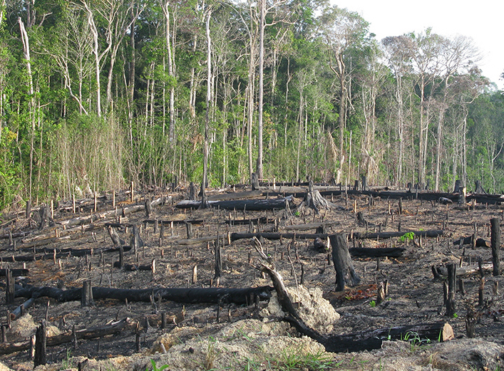
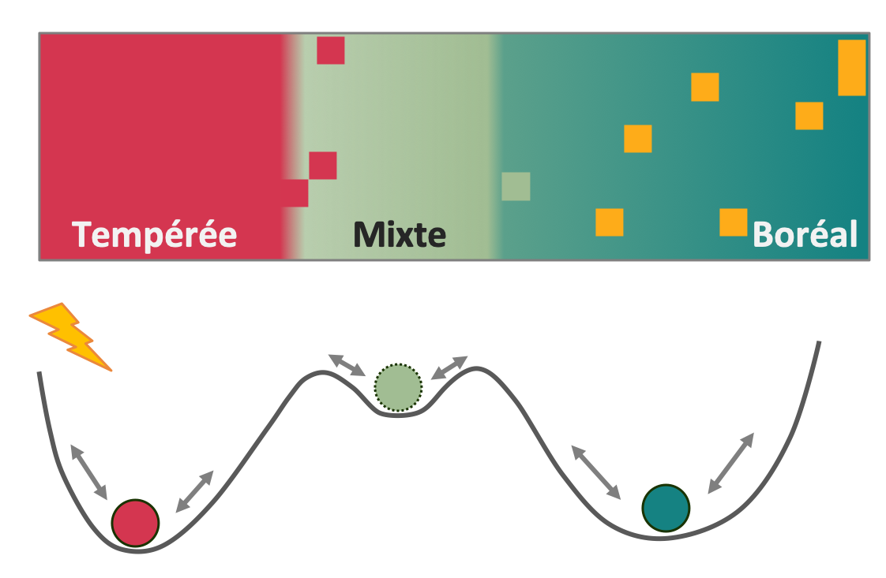

```{r setup, echo = FALSE}
knitr::opts_chunk$set(
  comment = "#",
  collapse = TRUE,
  warning = FALSE,
  message = FALSE,
  echo = FALSE,
  fig.width=5, fig.height=5,
  fig.align = 'center',
  fig.retina = 3
)
```

```{r library, include = FALSE}
library(graphicsutils)
library(diagram)
library(dplyr)
library(msm)
library(latex2exp)
library(scales)
source("funs.R")
```

```{r data, include = FALSE}
msm_glb <- readRDS("data/msm_glb.RDS")
states_ba <- readRDS("data/states_envba.RDS") %>% 
  arrange(plot_id, year_measured) %>% 
  na.omit() %>%
  group_by(ID_PE) %>% filter(n() > 1) %>% ungroup()

env_sc <- scale(states_ba[,c("sTP", "sCMI", "DRAIN", "PH_HUMUS")])

states <- c("Boreal", "Mixed", "Pionieer", "Temperate")

st_col <- c("#158282", "#A1BD93", "#FEAC19", "#D43650")

ll_mixed <- which(states_ba$ecoreg3=="Mixed")
mixed_mean <- as.list(apply(env_sc[ll_mixed,], 2, mean))
covar_log <- list(mixed_mean,
                  c(logging1 = 1, mixed_mean),
                  c(logging2 = 1, mixed_mean))

```


## Déplacement des niches

Future climate envelope for Sugar Maple (2071-2100)

.center[

]

.footnote[McKenney et al. 2007. BioScience.]


---
## Constraints to migration

- Slow demographics
- Limited dispersion
- Interspecific competition
- Soil heterogeneity

.center[]

---
## Alternative stable states

<br>

.center[]

.footnote[Johnstone et al. 2016]


---
## bjectifs


**Understand the constraints and drivers underlying the transition dynamics of Quebec's forests.**


> .image-holder[  What are the trends in recent forest transition dynamics? ]
>
> .image-holder[  How do disturbances influence the transition probabilities among forest states? ]
>
> .image-holder[  What is the impact of different disturbance intensities on the potential equilibrium and transient dynamics? ]


<br>

.center[.image-holder[





]]


---
## Data

Québec Forest inventories 	
  - 12000+ permanent plots sampled during 5 large inventories between 1970 and 2018 (by the MFFP)
  - Selection of 11058 plots surveyed at least twice each


.center[

]


---
## Data

.center[

]


---
## Multi-state continuous-time Markov model

```{r trans_time, fig.width=6, fig.height=2.4}
pos <- coordinates(pos = 4)
pos[,1] <- pos[,1] + c(-.015,0.025,-.01,0)
labs <- c(expression(bold('State'[0])),
          expression(bold('State'[1])),
          expression(bold('State'["..."])),
          expression(bold('State'["n"])))
curv <- c(-0.7, -0.95, -0.8)

par(mar=c(0,0,0,0))
openplotmat(main = "")
for (i in 1:4) {
  textellipse(mid=pos[i,], radx = 0.105, lab = labs[i], cex = 1.7,
              col = '#404940', shadow.col='#98B283', shadow.size = 0.005)
  }
for (i in 1:3) {
  curvedarrow(from = pos[i, ] + c(.01, .12), to = pos[i+1, ] + c(-.01, .12),
              curve = curv[i], arr.type = "triangle", arr.length=.4, arr.width=.5,
              arr.pos = .5, lwd = 4, lcol ="grey40", arr.col ="grey40")}

straightarrow(from = pos[1, ] - c(0, .22), to = pos[4, ] - c(0, .22),
              arr.type = "triangle", arr.pos = 1, lwd = 15, lcol ="grey60", arr.col ="grey60",
              arr.length=.7, arr.width=.7)
textplain(pos[4, ] - c(0, .35), lab = "Time", cex = 1.7)
```

.left-column[
<br>
**Climate**

<br><br>

**Disturbances**

<br><br>

**Soil**
]

.right-column[
>  Growing season temperature at $t_{i-1}$

>  Climate Moisture Index (CMI) at $t_{i-1}$ 

<br>
>  Natural disturbances between $t_{i-1}$ and $t_{i}$

>  Logging between $t_{i-1}$ and $t_{i}$

<br>
>  Soil pH

>  Soil drainage

]

---
## Model

###### Intensity matrice Q containing instantaneous transition risks (row to columns)

```{r qmatrix, fig.height=3, fig.width=5}
qmat <- c("$-\\sum_{s \\neq B} q_{Bs}$","q_{BM}", "q_{BP}", 0,
          "q_{MB}", "$-\\sum_{s \\neq M} q_{Ms}$", "q_{MP}", "q_{MT}",
          "q_{PB}", "q_{PM}", "$-\\sum_{s \\neq P} q_{Ps}$", "q_{PT}",
          0, "q_{TM}", "q_{TP}", "$-\\sum_{s \\neq T} q_{Ts}$")

par(mar=c(0,0,0,0))
plot0(xlim = c(0,9), ylim = c(1,9), xpd = NA, yaxs = "i")
text(.2, 5, expression(paste(bold("Q")," =")), cex = 2, col = '#404940')
lines(c(1,1), c(1.5,8.5))
lines(c(9,9), c(1.5,8.5))
text(rep(c(2,4,6,8),4),rep(c(8,6,4,2),ea=4), TeX(qmat), cex = 1.5, col = '#404940')
```

<br>
**All transtions among all states except to Pioneer:**

$$q_{rs} = \textbf{baseline} \times exp(\beta_{c} \times \textbf{climate} + \beta_{p} \times \textbf{disturbance} + \beta_{s} \times \textbf{soil})$$

**Transitions to Pioneer:**

$$q_{rs} = \textbf{baseline} \times exp(\beta_{p} \times \textbf{disturbance})$$

---
## Observed transitions

```{r trans_diag, fig.width=11.5, fig.height=8}
trans_nb <- statetable.msm(states_num, plot_id, data = states_ba)
rownames(trans_nb) <- colnames(trans_nb) <- states
trans_perc <- t(round(trans_nb/rowSums(trans_nb)*100, 1))

# pos.box <- cbind (c(0.5, 0.15, 0.85, 0.5),
#                   c(0.85, 0.5, 0.5, 0.15))
# 
# par(mar=c(0.5,0.5,0.5,0.5))
# 
# pm <- plotmat(trans_perc, pos = pos.box, curve = 0.07, name = states,
#               lwd = 2, relsize = .9, box.cex = 1.8,
#               cex.txt = 0, txt.col = "white", dtext = .45, txt.font = 2,
#               box.lwd = 0.1, box.type = "rect", shadow.size = 0.005,
#               box.prop = 0.4, box.size = 0.105, box.col = st_col,
#               arr.length=.15, arr.width=.2,  arr.type ="triangle",
#               arr.col ="grey40", arr.lcol = "grey40",
#               self.cex = 0.65, self.lwd = 2,
#               self.shifty = c(.07,0,0,-.07), self.shiftx = c(0,-.14,.14,0),
#               self.arrpos = c(-1,0,3,.5))
# 
# pm$arr$TextX[5] <- pm$arr$TextX[5]-.01
# pm$arr$TextX[10] <- pm$arr$TextX[10]+.01
# pm$arr$TextX[6] <- pm$arr$TextX[6]-.015
# pm$arr$TextX[11] <- pm$arr$TextX[11]+.02
# text(pm$arr$TextX, pm$arr$TextY, paste0(pm$arr$Value, "%"), cex = 1.4, font = 2)

arr_l <- trans_perc/40
diag(arr_l) <- 0
col_txt <- as.vector(ifelse(arr_l==0, "white", "black"))

pos.box <- cbind (c(0.5, 0.2, 0.8, 0.5),
                  c(0.8, 0.5, 0.5, 0.2))

par(mar=c(0,0,0,0))
pm <- plotmat(trans_perc, pos = pos.box, curve = 0.07, name = states, 
              lwd = 1.2, relsize = .9,
              box.cex = 2, cex.txt = 0, txt.col = "white",
              dtext = .3, txt.font = 2,
              box.lwd = 0.1, box.type = "rect", shadow.size = 0.005,
              box.prop = 0.35, box.size = 0.13, box.col = st_col,
              arr.length = arr_l, arr.width = arr_l,  arr.type ="triangle",
              arr.lcol = "grey40",
              arr.lwd = trans_perc*.8, self.cex = .45, self.lwd = diag(trans_perc)*.8,
              self.shifty = c(.07,0,0,-.07), self.shiftx = c(0,-.14,.14,0))
pm$arr$TextY[1] <- pm$arr$TextY[1]+.05
pm$arr$TextY[16] <- pm$arr$TextY[16]-.05
pm$arr$TextX[5] <- pm$arr$TextX[5]-.01
pm$arr$TextX[10] <- pm$arr$TextX[10]+.01
pm$arr$TextX[6] <- pm$arr$TextX[6]-.06
pm$arr$TextX[7] <- pm$arr$TextX[7]+.03
pm$arr$TextX[8] <- pm$arr$TextX[8]-.03
pm$arr$TextX[9] <- pm$arr$TextX[9]+.03
pm$arr$TextX[11] <- pm$arr$TextX[11]+.06
text(pm$arr$TextX, pm$arr$TextY, pm$arr$Value, cex = 1.6, col = col_txt)
```


```{r trans_flow, fig.width=12, fig.height=7.5, eval = FALSE}
pos <- coordinates(pos = 4, my = -.4)
pos1 <- c(.5,.85)
curv1 <- c(.4,.48,.52,.6)
curv2 <- c(.2,.4,.6,.8)

par(mfrow = c(2,2))
for(st in 1:4) {
  par(mar=c(0,0,0,0.7))
  openplotmat(main = "")
  for(i in 1:4) {
    xspline(x = c(pos1[1], curv1[i], curv2[i], pos[i,1]),
            y = c(pos1[2]-.02, 0.5, 0.3, pos[i,2]),
            s = 1, lwd = trans_perc[i,st]/2.5, border = "grey40")
  }


  textrect(mid=pos1, radx = 0.11, rady = 0.07,
           lab = states[st], cex = 1.6, font = 2,
           col = "white", box.col = st_col[st], lcol = st_col[st],
           shadow.size = 0.005)
  textplain(mid = pos1 + c(0,.1), lab = paste0("n = ", colSums(trans_nb)[st]),
            cex = 1.3, font = 2)

  for (i in 1:4) {
    textrect(mid=pos[i,], radx = 0.11, rady = 0.07, lab = states[i],
             cex = 1.6, font = 2,
             col = "white", box.col = st_col[i], lcol = st_col[i],
             shadow.size = 0.005)

    if(i %in% 1:2) l = -.06
    if(i %in% 3:4) l = .06
    textplain(mid = pos[i,]+c(l,.1), lab = paste0(trans_perc[i,st], "%"),
              cex=1.3, font=2, col = "grey25")
  }

}

```


---
## Transition probabilities

##### No or minor logging

```{r pmat_disturb0, fig.width=10, fig.height=7}
plot_pmat(mod = msm_glb, covariates = covar_log[[1]])
```


---
## Transition probabilities

##### Moderate logging

```{r pmat_disturb1, fig.width=10, fig.height=7}
plot_pmat(mod = msm_glb, covariates = covar_log[[2]])
```

---
## Transition probabilities

##### Major logging

```{r pmat_disturb2, fig.width=10, fig.height=7}
plot_pmat(mod = msm_glb, covariates = covar_log[[3]])
```

---
## Potential equilibrium proportion

<br>
```{r prep_barplot, fig.width=8, fig.height=5}
init <- states_ba %>% 
  group_by(ID_PE) %>% 
  arrange(year_measured) %>% 
  slice(1) %>% filter(year_measured<1980)
init <- table(init$states_ba)
init <- init/sum(init)

dl <- list(list(logging1 = 0), list(logging1 = 1), list(logging2 = 1))
qmats <- lapply(dl, function(x)
  qmatrix.msm(msm_glb, covariates = x, ci = "none"))

SS <- lapply(qmats, function(x) steady_state(qmat = x))
SS <- rbind(init, do.call(rbind, SS))

colss <- c("#2c7b8f", "#f1ba53","#E38451", "#b5305d")
lgd <- c("True initial proportion", 
         "Equilibrium - No or minor logging", 
         "Equilibrium - Moderate logging", 
         "Equilibrium - Major logging")
```

```{r barplot1, fig.width=9.2, fig.height=6.5}
barplot_index(index = SS, bars = 1, lgd = lgd, colss = colss, ylim = c(0,1),
              ylab = "State proportion")
```

---
## Potential equilibrium proportion

<br>
```{r barplot2, fig.width=9.2, fig.height=6.5}
barplot_index(index = SS, bars = 1:2, lgd = lgd, colss = colss,  ylim = c(0,1),
              ylab = "State proportion")
```

---
## Potential equilibrium proportion

<br>
```{r barplot3, fig.width=9.2, fig.height=6.5}
barplot_index(index = SS, bars = 1:3, lgd = lgd, colss = colss, ylim = c(0,1),
              ylab = "State proportion")
```

---
## Potential equilibrium proportion

<br>
```{r barplot4, fig.width=9.2, fig.height=6.5}
barplot_index(index = SS, bars = 1:4, lgd = lgd, colss = colss, ylim = c(0,1),
              ylab = "State proportion")
```

---
## Ecotone shift at equilibrium

```{r prep_SS}
tp_grad <- seq(-1.9, 1.6, len = 50)

df <- expand.grid(sTP = tp_grad, logging = c(0,1, 2), 
                  sCMI = mixed_mean[[2]],
                  DRAIN = mixed_mean[[3]],
                  PH_HUMUS = mixed_mean[[4]])


sc_sTP <- c(attr(scale(states_ba$sTP), "scaled:center"),
            attr(scale(states_ba$sTP), "scaled:scale"))
x <- tp_grad * sc_sTP[2] + sc_sTP[1]

tp_mixed <- quantile(states_ba$sTP[states_ba$ecoreg3=="Mixed"], c(.2,.8))


qmats <- apply(df, 1, function(x)
  qmatrix.msm(msm_glb, covariates = as.list(x), ci = "none"))

SS <- apply(qmats, 2, function(x) steady_state(qmat = matrix(x, 4, 4)))

bb <- SS[1,]
tt <- SS[4,]
```


##### No or minor logging
```{r steady_state11, fig.width=10.7, fig.height=6.5}
plot_SS(logging = 0, lang = "en")
```

---
## Ecotone shift at equilibrium

##### Moderate logging
```{r steady_state12, fig.width=10.7, fig.height=6.5}
plot_SS(logging = 0:1, lang = "en")
```

---
## Ecotone shift at equilibrium

##### Major logging
```{r steady_state13, fig.width=10.7, fig.height=6.5}
plot_SS(logging = 0:2, lang = "en")
```


---
## Transient dynamics

```{r prep_transient}
qmats <- lapply(covar_log, function(x)
  qmatrix.msm(msm_glb, covariates = x, ci = "none"))

### Steady state from qmat
eig <- lapply(qmats, function(x) eigen(t(x)))
pi <- lapply(eig, function(x) t(x$vectors[,which(abs(x$values) < 1e-12)]))
steady <- lapply(pi, function(x) x/sum(x))
steady <- lapply(steady, "colnames<-", states)

### Convergence to steady state - Damping ratio
lambda <- lapply(eig, function(x) sort(x$values, decreasing = TRUE)[2])

damping <- lapply(lambda, function(x) exp(abs(x)))

### Half life to steady state
halflife <- lapply(damping, function(x) log(90)/log(x)) 

### Sojourn time = turnover time from Hill

sojs <- lapply(covar_log, function(x)
  sojourn.msm(msm_glb, covariates = x, ci = "none")[[1]])
#sojs_contrib <- mapply("*", sojs, steady, SIMPLIFY = FALSE)

halflife <- unlist(halflife)
sojs <- do.call(rbind, sojs)

```

Sojourn time  turnover; time spent in a state before making a transition

Convergence time  time to reach 90% of the equilibrium

```{r barplot_tr0, fig.width=11, fig.height=6.5}
layout(matrix(c(1,2), 1), widths = c(1,.4))
barplot_index(index = as.matrix(sojs), bars = 1, 
              ylab = "Sojourn time (years)", ylim = c(0,200), lang = "en")
barplot_halflife(index = halflife, bars = 1, ylim = c(0, 850), lang = "en")
```

---
## Transient dynamics

Sojourn time  turnover; time spent in a state before making a transition

Convergence time  time to reach 90% of the equilibrium

```{r barplot_tr1, fig.width=11, fig.height=6.5}
layout(matrix(c(1,2), 1), widths = c(1,.4))
barplot_index(index = as.matrix(sojs), bars = 1:2, 
              ylab = "Sojourn time (years)", ylim = c(0,200), lang = "en")
barplot_halflife(index = halflife, bars = 1:2, ylim = c(0, 850), lang = "en")
```

---
## Transient dynamics

Sojourn time  turnover; time spent in a state before making a transition

Convergence time  time to reach 90% of the equilibrium


```{r barplot_tr2, fig.width=11, fig.height=6.5}
layout(matrix(c(1,2), 1), widths = c(1,.4))
barplot_index(index = as.matrix(sojs), bars = 1:3, 
              ylab = "Sojourn time (years)", ylim = c(0,200), lang = "en")
barplot_halflife(index = halflife, bars = 1:3, ylim = c(0, 850), lang = "en")
```

---
## Conclusions

<br>
> .image-holder[  What are the trends in recent forest transition dynamics? ]

.alert[Possibly, but hardly with no disturbances.]

> .image-holder[  How do disturbances influence the transition probabilities among forest states? ]

.alert[Yes. Moderate disturbances, not major, favour Mixed-Temperate and Boreal-Mixed transitions.]

> .image-holder[  What is the impact of different disturbance intensities on the potential equilibrium and transient dynamics?]

.alert[Moderate disturbances, not major, tend to increase the proportion of Temperate at equilibrium, moving the ecotone northward.]

.alert[Moderate disturbances, not major, accelerate transient dynamics.]


---
## Conclusions

États alternatifs stables ***sans*** changements climatiques

<br>

.center[

]

---
## Conclusions

États alternatifs stables ***avec*** changements climatiques

<br>

.center[

]


---
## Résultats du modèle msm

```{r coef, fig.width=9.5, fig.height=7.6}
plot_risk(msm_glb)
```


